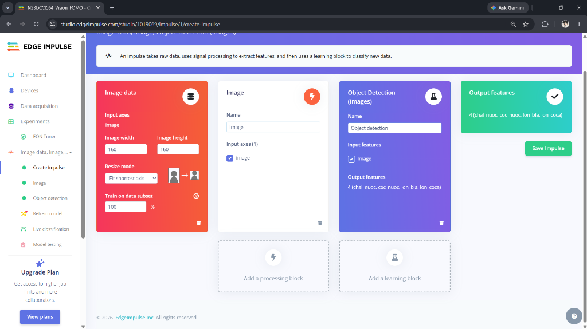
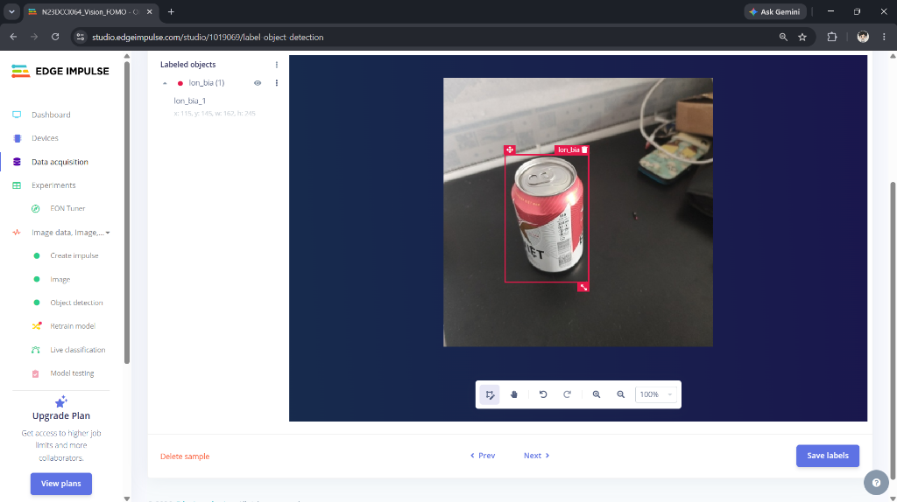
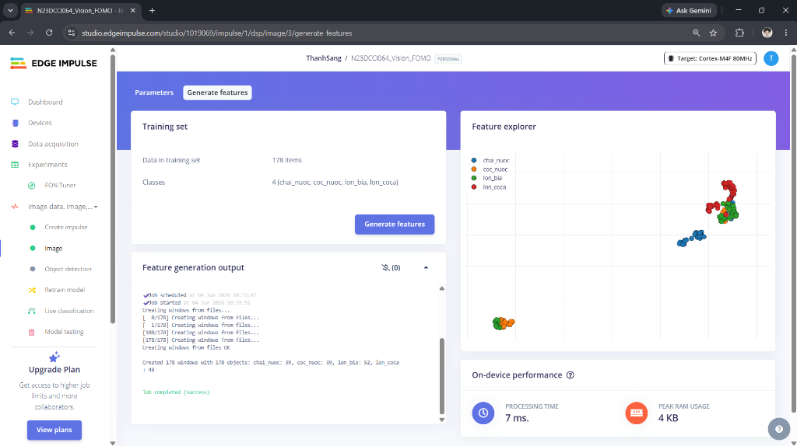
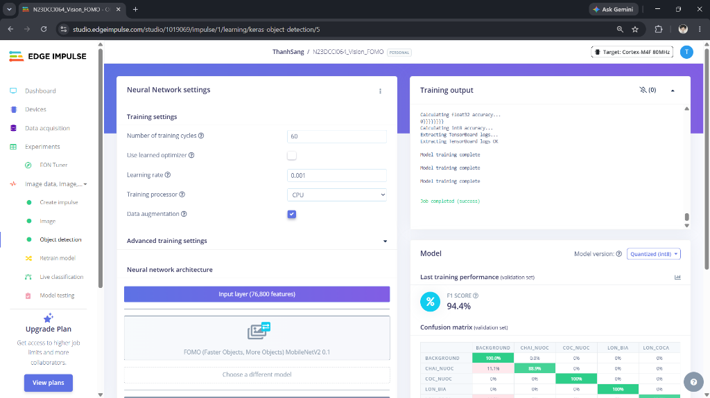
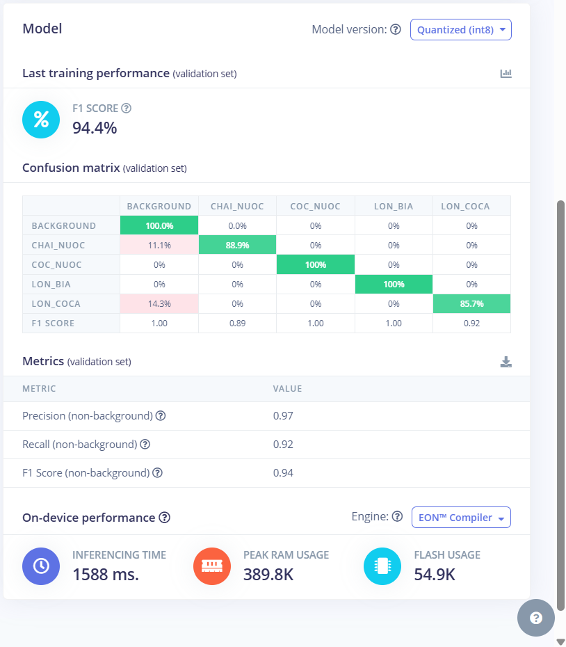

# Phát hiện đồ uống trên bàn (Vision-FOMO)

Dự án môn học Mạng cảm biến - Học viện Công nghệ Bưu chính Viễn thông (PTIT) Cơ sở tại TP. Hồ Chí Minh.

*   **Sinh viên thực hiện:** Phạm Thanh Sang
*   **MSSV:** N23DCCI064
*   **Lớp:** D23CQCI01-N
*   **Ngành:** Công nghệ Internet vạn vật (IoT) - Khoa Viễn thông 2
*   **Giáo viên hướng dẫn:** Hồ Nhựt Minh
*   **GitHub Repository:** [mangcambien-cuoiky-PhamThanhSang](https://github.com/P-ThanhSang/mangcambien-cuoiky-PhamThanhSang)


## Cấu trúc thư mục

```text
mangcambien_final/
├── assets/                     # Lưu trữ hình ảnh minh chứng hiệu năng của dự án
│   └── images/                 # Ảnh chụp cấu hình mô hình, confusion matrix từ Edge Impulse
├── dataset/                     # Dữ liệu ảnh mẫu thu thập thực tế (chia theo nhãn)
│   ├── chai_nuoc/              # Ảnh mẫu nhãn "chai nước"
│   ├── coc_nuoc/               # Ảnh mẫu nhãn "cốc nước"
│   ├── lon_bia/                # Ảnh mẫu nhãn "lon bia"
│   └── lon_coca/               # Ảnh mẫu nhãn "lon coca"
├── web_dashboard/              # Ứng dụng web kiểm thử realtime mô hình WebAssembly
│   ├── index.html              # Giao diện Dashboard (Glassmorphism, Dark mode)
│   ├── style.css               # Style giao diện CSS
│   ├── app.js                  # Logic điều khiển camera và suy luận mô hình WASM
│   └── public/                 # Chứa gói WASM từ Edge Impulse (edge-impulse-standalone)
├── .gitignore                  # Danh sách file/thư mục không theo dõi bởi Git
└── README.md                   # Hướng dẫn sử dụng và báo cáo tổng quan dự án
```


## Hướng dẫn cài đặt và sử dụng

### 1. Kiểm thử Realtime Web Dashboard
Yêu cầu Node.js cài sẵn trên máy tính.
```bash
cd web_dashboard
npm install
npm run dev
```
Sau đó mở trình duyệt và truy cập địa chỉ `http://localhost:5173` để mở camera và chạy thử mô hình.

## Kết quả huấn luyện mô hình (Edge Impulse)

Dưới đây là một số hình ảnh thực tế từ quá trình cấu hình và huấn luyện mô hình nhận diện đồ uống trên nền tảng Edge Impulse:

### 1. Cấu hình Impulse (Impulse Design)
Mô hình sử dụng dữ liệu ảnh đầu vào kích thước `160x160` pixel, đi qua khối trích xuất đặc trưng Raw Image và huấn luyện bằng thuật toán Object Detection (FOMO).



### 2. Gán nhãn dữ liệu (Data Labeling)
Các mẫu ảnh được gán nhãn thủ công với các hộp giới hạn định vị cho các đối tượng: `coc_nuoc`, `chai_nuoc`, `lon_bia`, `lon_coca`.



### 3. Trích xuất đặc trưng (Feature Explorer)
Biểu đồ phân tách các đặc trưng của 4 nhãn đồ uống trong không gian 2D cho thấy độ phân tách rõ ràng, giúp mô hình phân loại chính xác và giảm nhầm lẫn.



### 4. Cấu hình mạng nơ-ron (Neural Network Settings)
Sử dụng mô hình MobileNetV2 0.1 siêu nhẹ, được huấn luyện qua 60 epochs với learning rate là 0.001 và kỹ thuật Data Augmentation để tăng độ tổng quát.



### 5. Kết quả đánh giá hiệu năng (Confusion Matrix)
Mô hình đạt hiệu năng xuất sắc trên tập kiểm thử (validation set) với F1-Score tổng thể là **94.4%** (trong đó cốc nước và lon bia đạt F1-Score tuyệt đối 100%).



